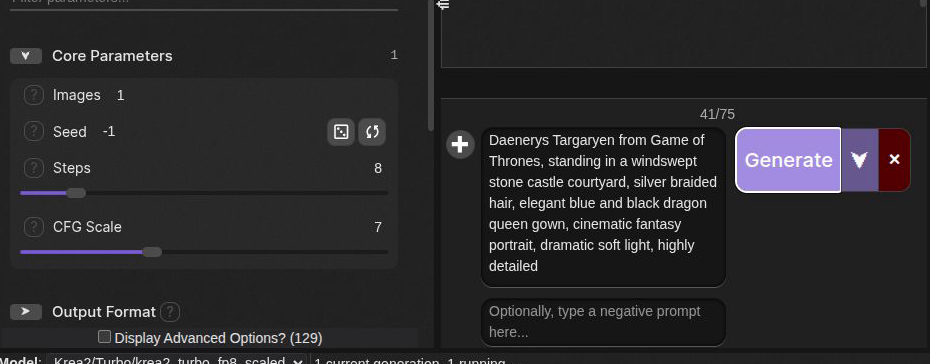
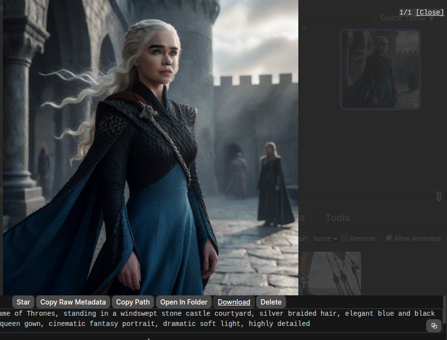
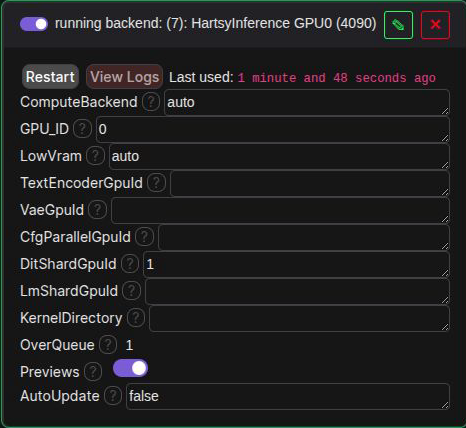
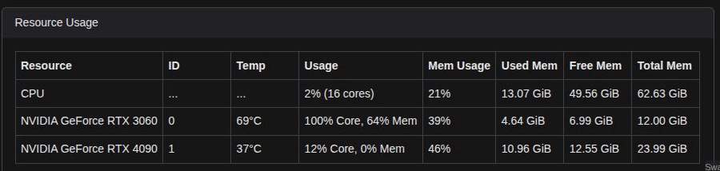

# HartsyInference for SwarmUI

Generate images, videos, and music locally without managing Python, virtual environments, workflow servers, or a pile of separate add-ons.

HartsyInference is a fast, all-in-one generation backend that runs inside [SwarmUI](https://github.com/mcmonkeyprojects/SwarmUI). You keep the familiar model picker, prompt box, history, previews, and generation controls. HartsyInference handles loading the model and creating the result in the same application.


## Why HartsyInference feels easier

A **backend** is the part of SwarmUI that loads a model and turns your prompt into an image, video, or song. HartsyInference gives SwarmUI a local backend built in C#, so there is less to install, start, update, and troubleshoot.

| What you get | Why it matters |
| --- | --- |
| **One application to start** | The generation engine runs inside SwarmUI. There is no second server to launch or keep connected. |
| **No Python environment** | No virtual environment, package conflicts, or Python version to manage. |
| **Useful features included** | Editing, inpainting, LoRAs, guided generation, previews, cancellation, and memory handling are available without collecting separate add-ons. |
| **Automatic memory handling** | Models can use memory-saving behavior when they do not fit normally. Cards with enough room keep the faster path. |
| **Images, video, and music together** | Use the same Generate tab and output history across supported model types. |
| **Real multi-GPU support** | Run separate jobs in parallel or split one supported model across two cards. |

## Proof, not promises

| Example | Result |
| --- | --- |
| Krea 2 Turbo | 1024 x 1024 in **4.50 seconds** on an RTX 4090 |
| Qwen-Image 20B | 1024 x 1024 in **40.9 seconds** on an RTX 4090 |
| Two-GPU generation | One Krea 2 job split across an RTX 4090 and RTX 3060 |
| Model coverage | Image, video, editing, restoration, and music families in one backend |

The benchmark table and testing notes are available [below](#benchmarks).

## What you need

- A working SwarmUI installation on Windows or Linux.
- An NVIDIA GPU with a current driver for practical image and video generation.
- An internet connection for the first build and for model downloads.
- Free drive space for the models you choose. Individual model downloads can range from a few GB to dozens of GB.

### A practical hardware guide

Model requirements vary, but these are useful starting points:

| Hardware | What to expect |
| --- | --- |
| **12 GB VRAM** | A good starting point for smaller image models and memory-saving versions of larger models. Large models will be slower when weights must move between system memory and the GPU. |
| **24 GB VRAM** | A much wider choice of image and video models, with more room for full-speed operation. |
| **Two NVIDIA GPUs** | Optional. Use both for parallel jobs, place parts of a model on different cards, or split a supported large model across them. |

System memory and storage matter too. Larger models need more of both. If you are unsure, start with a smaller or quantized checkpoint and a 1024 x 1024 image.

HartsyInference ships as a package dependency of this extension. You do not install the engine separately.

> **Current status:** HartsyInference is in beta. Many model families and advanced tools work today, but exact feature support varies by model.

## Installation

### From SwarmUI

Use this method when **SwarmUI-HartsyInference-Backend** appears in SwarmUI's extension list:

1. Open **Server** > **Extensions**.
2. Find **SwarmUI-HartsyInference-Backend**.
3. Select **Install**.
4. Let SwarmUI rebuild, then restart when prompted.

### Manual installation

Close SwarmUI, open a terminal in its extension folder, and clone the repository:

```bash
cd /path/to/SwarmUI/src/Extensions/
git clone https://github.com/HartsyAI/SwarmUI-HartsyInference-Backend.git
```

Extensions are compiled, so restarting by itself is not enough. Rebuild SwarmUI:

- On Windows, run `update-windows.bat` from the main SwarmUI folder.
- On Linux, run `update-linuxmac.sh` from the main SwarmUI folder.

Start SwarmUI after the build finishes.

## Your first generation

This is the complete path from an installed extension to a finished image.

### 1. Add the backend

1. Open **Server** > **Backends**.
2. Turn on **Show Advanced**.
3. Select **HartsyInference (Pure C# Inference)**.
4. Keep `ComputeBackend`, `GPU_ID`, and `LowVram` at their defaults.
5. Save and wait for the card to say **running backend**.

For a normal one-GPU setup, leave all fields ending in `GpuId` empty.

### 2. Add or choose a model

HartsyInference uses SwarmUI's normal model folders and model picker. If you already have a compatible local checkpoint, refresh the model list and select it.

For a straightforward first image, use a supported turbo or schnell image checkpoint that fits your GPU. Krea 2 Turbo and Z-Image Turbo are fast choices on higher-memory NVIDIA cards. Model licenses and hardware needs differ, so check the model page before downloading.

Your model root is shown under **Server** > **Server Configuration** > **Paths** > **ModelRoot**. Place the checkpoint in the matching model folder, then refresh SwarmUI's model list.

Some model families need companion files such as a text encoder or VAE. HartsyInference downloads known companion files when possible. If something cannot be prepared automatically, SwarmUI shows what is missing.

### 3. Generate

1. Open **Generate**.
2. Pick your model.
3. Enter a prompt.
4. Select **Generate**.

This example uses Krea 2 Turbo, eight steps, and a 1024 x 1024 canvas:



The finished result appears in the normal SwarmUI history. Select it to view the full image, prompt, settings, seed, and generation details.



## What you can create

### Create images from a prompt

Generate with families such as Stable Diffusion 1.5, SDXL, SD3, SD3.5, FLUX.1, FLUX.2, Qwen-Image, Z-Image, Krea 2, Chroma, AuraFlow, Anima, F-Lite, Ideogram 4, HunyuanImage, ERNIE-Image, and Boogu.

### Edit and repair images

- Start from an existing image and control how much it changes.
- Paint a mask over an area to replace or repair it.
- Refine one model's result with another supported image model.
- Make seamless images for repeating textures and backgrounds.
- Use supported reference-image models for instruction-based edits.

### Guide the composition

- Use pose, depth, edges, line art, soft edges, scribbles, normals, or segmentation maps to guide the result.
- Use IP-Adapter variants to carry visual style, facial features, or identity from a reference image.
- Stack supported ControlNets and LoRAs with individual strengths.

These controls use names such as **ControlNet**, **IP-Adapter**, and **LoRA** in SwarmUI. They appear only when the selected model can use them.

### Create and restore video

Supported families include Wan 2.x, Wan VACE, Wan Animate, Wan speech-to-video, LTX-Video, LTX-2, HunyuanVideo, Kandinsky 5, and MiniMax H3.

Depending on the model, SwarmUI can show controls for frame count, frame rate, format, image-to-video, reference media, trimming, boomerang playback, audio, and SeedVR2 restoration.

### Create music

ACE-Step checkpoints generate music from the normal Generate tab. Music controls appear after you choose a compatible model.

### Stay in control

HartsyInference supports live previews, cancellation, variation seeds, early step stopping, and readable errors. If a model cannot use a requested feature, the backend explains the problem instead of quietly ignoring the setting.

## Backend settings

Most users only need the defaults:

| Setting | Default | What it does |
| --- | --- | --- |
| `ComputeBackend` | `auto` | Chooses the best available compute option. |
| `GPU_ID` | `0` | Chooses the main GPU. |
| `LowVram` | `auto` | Saves memory only when the model would not otherwise fit. |
| `OverQueue` | `1` | Lets one request wait behind the active generation. |
| `Previews` | on | Shows progress previews while generating. |
| `AutoUpdate` | `false` | Keeps engine updates manual. |

## Use more than one GPU

### Run separate jobs at the same time

Add one HartsyInference backend for each GPU. Give each backend a different `GPU_ID`. SwarmUI can then send different generations to different cards.

### Split one model across two GPUs

One backend can use a second GPU for the same generation:

| Setting | Use it for |
| --- | --- |
| `TextEncoderGpuId` | Move prompt processing to a second GPU. |
| `VaeGpuId` | Move image or video encoding and decoding to a second GPU. |
| `DitShardGpuId` | Split a supported image or video model across two GPUs to combine their available memory. |
| `LmShardGpuId` | Split a supported language or audio model across two GPUs. |
| `CfgParallelGpuId` | Run two guidance passes at once when both cards can hold the model. |

This backend used GPU 1 as the denoiser shard for a Krea 2 generation:



During that same job, SwarmUI showed both GPUs holding model data:



Sharding is mainly a way to gain memory. It does not always improve speed. See the [two-GPU guide](docs/15-Two-GPU-Setups.md) for examples and limits.

## Benchmarks

These results use the same request through the SwarmUI API on an RTX 4090. Each number is the warm median of three runs.

| Model | Size | Steps | HartsyInference | ComfyUI |
| --- | ---: | ---: | ---: | ---: |
| Z-Image Turbo | 1024 x 1024 | 8 | **2.95 s** | 3.1 s |
| Krea 2 Turbo | 1024 x 1024 | 8 | **4.50 s** | 6.5 s |
| Qwen-Image 20B GGUF | 1024 x 1024 | 20 | **40.9 s** | 54.8 s |

Hardware, checkpoint format, available memory, drivers, and generation settings can change performance. Full test settings and newer results are in the [HartsyInference performance guide](https://github.com/HartsyAI/HartsyInference/blob/main/docs/PERFORMANCE.md) and [benchmark results](https://github.com/HartsyAI/HartsyInference/tree/main/benchmarks/results).

## Troubleshooting

### The backend type is missing

Turn on **Show Advanced** under **Server** > **Backends**. If it is still missing, rebuild SwarmUI and check **Server** > **Logs** for extension build errors.

### The backend does not start

- Update your NVIDIA driver.
- Keep `ComputeBackend` set to `auto`.
- Confirm `GPU_ID` points to a real GPU.
- Open **Server** > **Logs** and search for `HartsyInference`.
- Rebuild SwarmUI after updating the extension or engine package.

### A model is missing

- Confirm the checkpoint is under the configured SwarmUI model root.
- Put it in the correct model folder.
- Refresh the model list.
- Make sure you selected the main checkpoint rather than a companion VAE or text encoder.

### The model runs out of memory

- Keep `LowVram` set to `auto`.
- Close other programs using the GPU.
- Try a smaller resolution, fewer video frames, or a smaller model version.
- Use a second GPU for placement or sharding when available.

### A control does not appear

Choose the model first. SwarmUI shows controls based on what the selected model supports.

### Report a problem

Open an issue in this repository with your operating system, GPU, model name, generation settings, and the related HartsyInference lines from **Server** > **Logs**. Do not post private prompts, images, access tokens, or API keys.

## More documentation

The README covers installation and everyday use. Deeper references are available in [`docs/`](docs/):

- [Backend lifecycle](docs/06-Backend-Lifecycle.md)
- [Parameters and feature flags](docs/07-Parameters-And-Feature-Flags.md)
- [Web API routes](docs/08-Web-API-Routes.md)
- [Known issues](docs/14-Known-Issues-And-TODO.md)
- [Two-GPU setups](docs/15-Two-GPU-Setups.md)

## License

This project is licensed under the [MIT License](LICENSE).

Model files keep their own licenses. Check each model's terms before using it, especially for commercial work.
